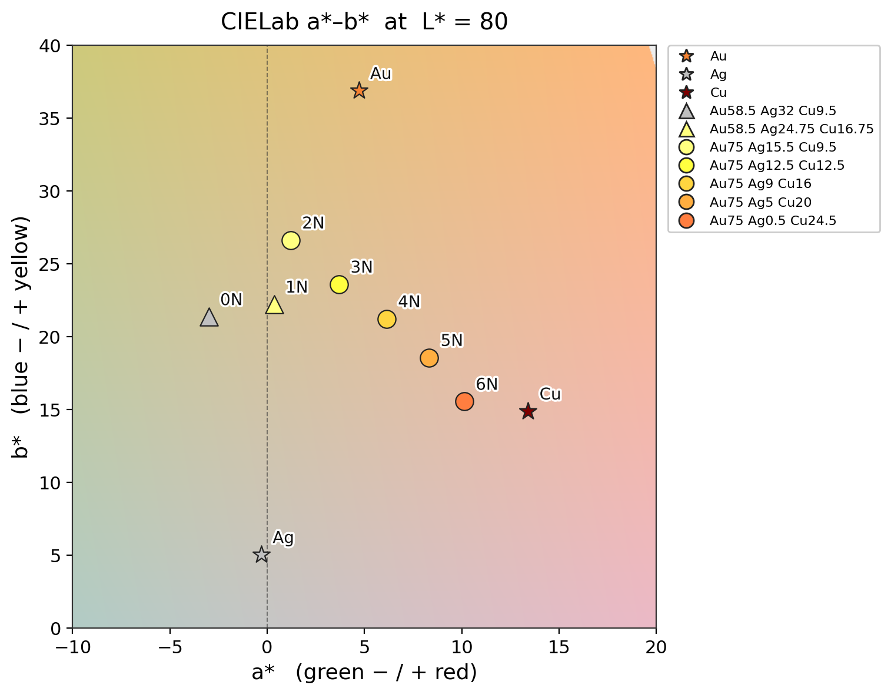
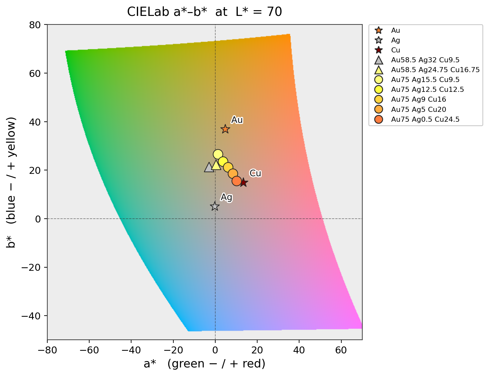
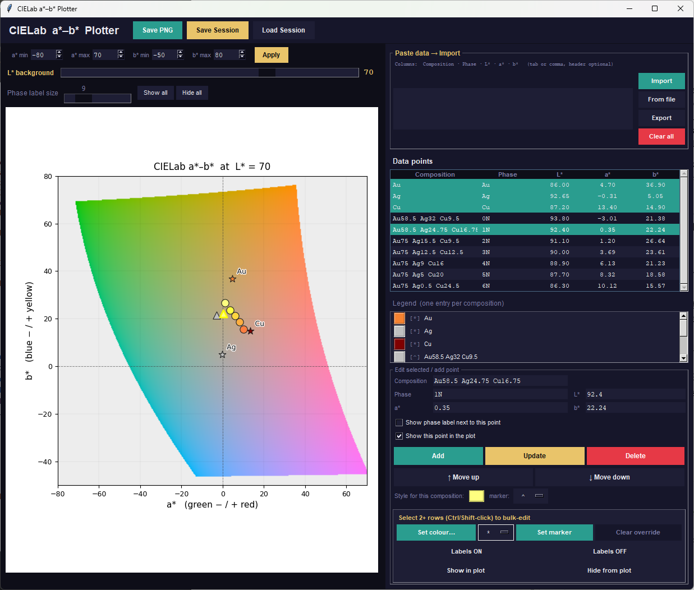

# CIELab a*–b* Plotter
A desktop tool to plot experimental CIELab colour-measurement data on top of
the true sRGB colour gamut at a chosen lightness L*. Each unique
composition automatically receives its own colour and marker and appears once in
the legend. The tool exports clean, publication-ready figures.
Developed for materials- and colour-science work (e.g. characterising the colour
of metallic alloys and their phases in L*a*b* space).


A typical colour space for the pure elements Au, Ag and Cu together with 14-karat gold alloys (0N - white gold, and 1N - yellow gold) and 18-karat gold alloys (2N, 3N, 4N, 5N, 6N). The alloy composition is given in mass-percent. The L-value of 80 is in the typical range for jewellery alloys.


The complete colour space at L = 70. The L-value can be defined by a slider.


A screenshot of the GUI that allows interactive selection and editing of data points and axis ranges.

# Features
Interactive a*–b* plot with the sRGB gamut rendered as a live background
Adjustable background lightness L* and a*/b* axis ranges
Automatic colour + marker assignment per composition, with a clean legend
Paste data directly or load it from a file (tab-, semicolon- or comma-separated)
Export publication-style PNG figures
Save and load working sessions
Requirements
Python 3.x
NumPy and Matplotlib
```bash
pip install matplotlib numpy
```
`tkinter` ships with standard Python on Windows and macOS.
On Linux install it with:
```bash
sudo apt install python3-tk
```
# Usage
Run the script:
```bash
python CIELab_Plotter.py
```
Then:
Paste your measurement table into the data box (or use From file).
Click Import. Each unique composition gets its own colour and marker.
Adjust the L* background slider and the a*/b* axis ranges as needed.
Save PNG for a clean, publication-style figure, or Save / Load Session
to continue working later.
Data format
Five columns, header row optional. Columns may be separated by a tab,
semicolon or comma:
```
Composition (mass%)	Phase	L*	a*	b*	Ref
Au			Au	86	4.7	36.9	[1]
Ag			Ag	92.65	-0.31	5.05	[6]
Cu			Cu	87.2	13.4	14.9	[9]
```
Additional columns with references can be added. You find selected example data in a csv. file. 
The software accepts tab-, comma- or semicolon-separated files.

References:
- [1] U.E. Klotz, Metallurgy and processing of coloured gold intermetallics — Part I: Properties and surface processing, Gold Bulletin 43 (2010) 4–10. https://doi.org/10.1007/BF0321496.
- [6] S. Henderson, D. Manchanda, White gold alloys:, Gold Bull 38 (2005) 55–67. https://doi.org/10.1007/BF03215234.
- [9] C. Leygraf, T. Chang, G. Herting, I. Odnevall Wallinder, The origin and evolution of copper patina colour, Corrosion Science 157 (2019) 337–346. https://doi.org/10.1016/j.corsci.2019.05.025.

# Citation
If you use this software, please cite it as [](https://doi.org/10.5281/zenodo.22811675).
A ready-to-use citation is available via the “Cite this repository” button on GitHub
(generated from `CITATION.cff`).
<!-- After connecting the repository to Zenodo, add your DOI badge and details: -->
<!-- [](https://doi.org/10.5281/zenodo.XXXXXXX) -->
```bibtex
@software{klotz_cielab_plotter,
  author  = {Klotz, Ulrich E.},
  title   = {CIELab a*--b* Plotter},
  year    = {2026},
  version = {1.0.0},
  doi     = {10.5281/zenodo.22811675},
  url     = {https://github.com/UlrichKlotz/CIELab_Plotter}
}
```

# License
This project is licensed under the GNU General Public License v3.0 or later
(GPL-3.0-or-later). See the `LICENSE` file for the full text.
You are free to use, study, modify and redistribute this software, provided that
derivative works remain under the GPL and preserve the original copyright and
author attribution.

# Author
Prof. Dr. Ulrich E. Klotz
Faculty of Applied Sciences and Mechatronics
Hochschule München University of Applied Sciences
© 2026
